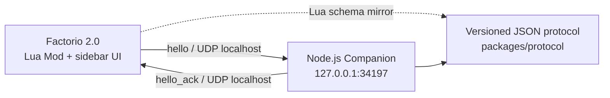

# Factorio AI Assistant

Factorio 2.0 原版的只读游戏内顾问。当前 M0 仅验证 Factorio Lua Mod 与本机
Node.js/TypeScript Companion 的 localhost UDP 双向通信；不接入模型、不扫描全图，
也不会修改工厂。

## 架构



浏览器可视化版本见 [`docs/architecture.html`](docs/architecture.html)。

## 仓库结构

| 路径 | 作用 |
| --- | --- |
| `factorio-mod/` | Factorio 2.0 Mod、连接状态面板和 UDP 心跳 |
| `companion/` | 只绑定 `127.0.0.1` 的 Node.js UDP Companion |
| `packages/protocol/` | 严格的版本化消息编解码与校验 |
| `docs/` | Windows 安装、协议、排错和实机验证清单 |

## 本地验证

需要 Node.js 22 或更高版本。

```bash
npm install
npm run build
npm test
npm run lint
```

启动 Companion：

```bash
npm start
```

完整的 Mod 安装、Steam 启动参数和 UI 预期见
[`docs/setup-windows.md`](docs/setup-windows.md)。线协议见
[`docs/protocol.md`](docs/protocol.md)。

## 安全边界

- Companion 固定绑定 IPv4 loopback `127.0.0.1`，没有公网监听配置。
- Factorio UDP 必须通过显式启动参数开启。
- M0 仅接受 `hello` 并返回 `hello_ack`；无 RCON、AI、遥测或自动操作。
- 仓库不读取或存储 API key、令牌等密钥。
