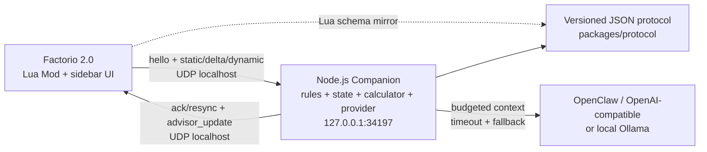

# Factorio AI Assistant

Factorio 2.0 原版的只读游戏内顾问。当前 M4 在 localhost UDP、确定性生产比例和实时
规则顾问之上增加安全的 Companion 配置与可替换 AI provider：OpenClaw /
OpenAI-compatible 优先，Ollama 可选；无 Key、模型离线、限流或超时时自动保留本地
计算与规则答案。系统不发送地图，也不会修改工厂。

## 架构



浏览器可视化版本见 [`docs/architecture.html`](docs/architecture.html)。

## 仓库结构

| 路径 | 作用 |
| --- | --- |
| `factorio-mod/` | Factorio 2.0 Mod、事件缓存、状态采样和连接面板 |
| `companion/` | 只绑定 `127.0.0.1` 的 Node.js UDP Companion、状态缓存、本地规则顾问、上下文压缩和 provider 层 |
| `packages/protocol/` | 严格的版本化消息编解码与校验 |
| `packages/calculator/` | 精确有理数生产流求解器、Factorio 2.0 fixture 与 JSON CLI |
| `docs/` | Windows 安装、协议、规则阈值、排错和实机验证清单 |

## 本地验证

需要 Node.js 22 或更高版本。

```bash
npm install
npm run build
npm test
npm run lint
```

启动 Companion：

```bash
npm start
```

默认输出 `assistant_mode: local`，不需要 API Key。完整的本机 JSON / 环境变量配置、
OpenClaw/OpenAI-compatible、Ollama、上下文边界、脱敏日志和模型故障排查见
[`docs/companion.md`](docs/companion.md)。

独立运行比例计算器（不需要游戏或 AI Key）：

```bash
npm run calculate -- \
  --catalog packages/calculator/fixtures/vanilla-2.0.72-base.json \
  --request packages/calculator/fixtures/chemical-science-120-per-minute.json \
  --pretty
```

catalog 使用状态协议中的 `recipes`、`machines`、`modules` 和当前 force 的
`recipe_productivity_bonuses`。request 的核心字段如下：

| 字段 | 说明 |
| --- | --- |
| `targets[]` | `kind`、`id`、`rate` 和可选 `unit`（`second` / `minute`） |
| `available_recipe_ids` / `recipe_choices` | 当前可用配方与替代配方显式选择；选择键为 `item:<id>` / `fluid:<id>` |
| `allowed_machine_ids` / `machine_choices` | 允许机器集合与按 recipe ID 的显式机器选择 |
| `module_loadouts` | 按 recipe ID 指定插件 ID 数组；校验槽位、类别和效果限制 |
| `technology_productivity_bonuses` | 按 recipe ID 覆盖当前科技产能加成 |
| `source_resources` | 视为外部供给、不继续展开的原料键 |
| `byproduct_handlers` / `byproduct_policy` | 指定副产物消费配方；`balanced` 要求无剩余，`surplus` 显示剩余 |
| `belt_speeds` | 可选物品带宽档位；默认原版黄 / 红 / 蓝带 `15 / 30 / 45 item/s` |

输出包含每条配方的 craft 速率、精确与向上取整机器数、机器 / 插件 / 科技假设、各层
物品和流体速率、外部原料、副产物及各级传送带需求。循环、不可达目标、替代配方歧义、
不兼容机器 / 插件和无法平衡的多产物流都会返回结构化错误，不会递归死循环。

完整的 Mod 安装、Steam 启动参数和 UI 预期见
[`docs/setup-windows.md`](docs/setup-windows.md)。线协议见
[`docs/protocol.md`](docs/protocol.md)。规则证据、默认阈值、静音和全部玩家可配置项见
[`docs/advisor.md`](docs/advisor.md)。

## 安全边界

- Companion 固定绑定 IPv4 loopback `127.0.0.1`，没有公网监听配置。
- 配置远程 bind 地址会拒绝启动；相同 UDP 请求幂等重放 ack，同 ID 冲突包拒绝。
- Factorio UDP 必须通过显式启动参数开启。
- 状态只含游戏 / Mod / force / prototype ID 和聚合数值；无坐标、地图、聊天或存档。
- 动态采样每 5 秒读取游戏统计和事件维护的 pole 缓存；没有 `on_tick` 全实体遍历。
- 实时规则顾问和计算器不调用模型；AI provider 只接收按问题压缩且有 byte budget 的
  聚合上下文，无 RCON、远程遥测或自动操作。
- API Key 只从 Companion 进程环境或显式本机配置读取，不进入 Mod、存档、UDP 或日志。
- 模型调用有取消、每次超时和最多一次有限重试；失败后返回本地结果。
