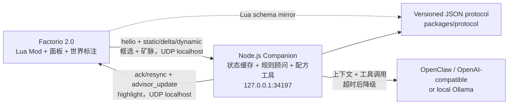

# Factorio AI Assistant

Factorio 2.0 的只读游戏内顾问。玩家用自然语言提问，Companion 把**本存档的真实数据**
交给模型推理：可造配方、实时产销、框选区域里每台机器的状态与接线、已探索的矿脉。
模型可以反过来在**游戏世界和地图上画标注**，指着具体机器或位置说话，而不是让你照着
坐标自己找。系统只读，永远不会修改工厂。

> **Steam 成就警告：** Factorio 启用任何 Mod 后，该存档都不能获得 Steam 成就。
> 安装前备份存档，并优先使用专门的测试副本。

## 它能做什么

- **就着你眼前的工厂提问**。用检查器框一片区域，问「这里为什么有机器不进料」。每台
  机器带 Factorio 自己的 `status`（缺料 / 输出堵塞 / 缺电），机械臂还带**从哪取料、
  给到哪**——所以答案能追到断料的源头，而不只是说「这台停了」。
- **答案会标在游戏里**。模型识别出问题机器或建议位置时，会在世界里画彩色方框加文字，
  同时打一个**地图标签**，打开地图就能定位。标注一直保留到你手动清除。
- **认得你存档里的叫法**。配方目录带游戏内显示名，所以你说「黄瓶」它能对上存档里的
  「银金分析包」，而不是按原版猜。
- **知道矿在哪**。已探索区域的矿脉按 chunk 聚合成一片片，带中心坐标和剩余储量，
  「下一个矿点开在哪」能给出具体位置并标出来。
- **模型不可用时不装懂**。没 Key、离线、限流或超时，会退回本地规则告警和确定性
  计算，并明确说明这是本地模式。

## 安装

从私有 GitHub Release 下载同一个版本的全部资产并核对 SHA-256，然后：

- **一键安装**：下载 `install.cmd` 与 `install.ps1` 放同一目录，双击 `install.cmd`。
  它会装好 Mod 与 Companion 并启动，**重复安装不会覆盖你的 `companion.config.json`**。
- **手动安装**：按 [`docs/setup-windows.md`](docs/setup-windows.md) 安装 Mod、配置
  Steam UDP 启动参数并运行 `start-companion.cmd`。

Mod 和 Companion 必须来自同一 bundle；混用版本时 UI 会显示双方版本并要求成对升降级。
本项目不发布到 Factorio Mod Portal。

## 架构



浏览器可视化版本见 [`docs/architecture.html`](docs/architecture.html)。

## Companion 持有上下文，模型按需索取

早期版本把整个配方目录（含原料）塞进每次请求。实测一个 200 配方的存档，光配方就要
**31.6 KB，占掉整个预算的 87%**，真正反映工厂现状的实时产销只剩 4%。

现在配方数据留在 Companion，只把**目录**（ID + 游戏内名称）发给模型，需要原料时它
自己调工具取：

| | 字节 |
| --- | ---: |
| 旧：完整配方块 | 21,912 |
| 新：目录（ID + 名称） | 4,840 |
| 新：`get_recipe` 取 5 条 | 545 |
| **节省** | **75.4%** |

省下的预算给了框选数据——现在框 200 台机器也不会被裁剪。

模型可用的只读工具：

| 工具 | 作用 |
| --- | --- |
| `get_recipe` | 取指定配方的原料、产物、制作时间 |
| `search_recipes` | 按名字或 ID 模糊搜，解决俗名对不上的问题 |
| `highlight_entities` | 在世界与地图上标注机器（按 `unit`）或位置（按坐标） |

工具轮次上限为 3，超出后强制模型用已取到的数据作答。细节与超时分层见
[`docs/companion.md`](docs/companion.md)。

## 仓库结构

| 路径 | 作用 |
| --- | --- |
| `factorio-mod/` | Factorio 2.0 Mod、状态采样、框选与矿脉扫描、世界标注渲染、顾问 UI |
| `companion/` | 只绑定 `127.0.0.1` 的 Node.js UDP Companion、状态缓存、本地规则顾问、上下文压缩、配方工具与 provider 层 |
| `packages/protocol/` | 严格的版本化消息编解码与校验 |
| `packages/calculator/` | 精确有理数生产流求解器、Factorio 2.0 fixture 与 JSON CLI |
| `packages/guide/` | 版本化的 Factorio 2.0 原版流程指南数据与阶段判定引擎 |
| `docs/` | Windows 安装、协议、规则阈值、开发流程、排错和实机验证清单 |
| `scripts/lua/` | Mod 的 Lua 规格测试与最小 Factorio 运行时替身（由 `npm test` 驱动） |

## 游戏内面板


预览使用内置 mock harness 的确定性数据绘制；自动化环境没有 Factorio 图形客户端，
Windows 实机截图仍列在验证清单中。

- **Chat**：消息历史、快捷问题、Enter 发送、取消请求、一键清空，以及**清除标注**。
  新消息后自动贴回底部；向上翻看历史时其它刷新不会把视图抢回底部。
- **迷你模式**：标题栏切换按钮，只显示最近一条回答和输入框，方便边看工厂边问。
  **回答到达时如果面板已关闭，会自动以迷你模式弹出**——一次提问可能要等上一两分钟，
  你多半已经走开了。自动弹出不会触发自动暂停：那是面板自己开的，不该冻结你正在做的事。
- **框选提问**：右下角快捷栏取出**AI 顾问检查器**，拖框选中一片区域后面板自动打开。
  扫描只在拖框时发生，不遍历全图。
- **Alerts**：按严重度显示证据和建议，可静音 / 恢复规则、逐条忽略或一键清理。主动提醒
  用 8 秒 toast，不刷屏聊天区。左上角还有常驻提醒卡片。
- **打开时自动暂停**：单人游戏中**手动**打开顾问会暂停游戏，关闭时恢复。每玩家可配置。
  本 Mod 只恢复自己触发的那次暂停。
- **Status**：Companion、模型模式、协议版本、最近同步、显示名称语言与隐私模式。

面板和回答按当前游戏语言称呼产品、流体、科技和机器（例如 `铁板` 而不是 `iron-plate`）。

### 快捷键

| 快捷键 | 作用 |
| --- | --- |
| `Ctrl+Shift+A` | 打开 / 关闭面板 |
| `Ctrl+Shift+1..3` | 切到 Chat / Alerts / Status |
| `Ctrl+Shift+C` | 清除地图标注 |
| `/ai <问题>` | 答案直接打进聊天区，不弹面板 |

窗口有多档尺寸，位置和尺寸按玩家写入存档。Companion 离线时所有页面仍可进入。

可在游戏控制台复现关键状态（建议先停掉 Companion，避免心跳覆盖 mock）：

```text
/factorio-ai-assistant-mock ready | offline | loading | timeout | incompatible
/factorio-ai-assistant-mock chat-long | chat-append | chat-cleared
/factorio-ai-assistant-mock alerts-none | alerts-one | alerts-many
/factorio-ai-assistant-mock alert-close | alert-reopen | clear
```

## 本地验证

需要 Node.js 22 或更高版本。`npm test` 除 TypeScript 包外，还会在一个最小的 Factorio
运行时替身上加载 `factorio-mod/` 的 Lua 模块。

```bash
npm install
npm run build
npm test
npm run lint
npm run check:release
npm run check:security
npm run benchmark
npm run package
npm run package:verify
```

启动 Companion：

```bash
npm start
```

默认输出 `assistant_mode: local`，不需要 API Key。完整的配置、provider、上下文边界、
超时分层和排错见 [`docs/companion.md`](docs/companion.md)。

### 开发

改 Companion 用热重载，改 Mod 用软链接，都不必反复打包：

```bash
npm run dev        # 编译 + 热重启 Companion
npm run dev:link   # 把 factorio-mod/ 链接进 Factorio mods 目录
npm run dev:stop   # 清理占住 UDP 端口的孤儿进程

node scripts/dev-ask.mjs "每分钟 60 个绿板要多少铜线"   # 不进游戏直接提问
```

**Companion 是热重载的，Mod 不是**：Factorio 只在进程启动时加载 Lua，改完 Mod 必须
重启游戏。详见 [`docs/development.md`](docs/development.md)。

### 独立计算器 CLI

不需要游戏或 AI Key：

```bash
npm run calculate -- \
  --catalog packages/calculator/fixtures/vanilla-2.0.72-base.json \
  --request packages/calculator/fixtures/chemical-science-120-per-minute.json \
  --pretty
```

输出包含每条配方的 craft 速率、精确与向上取整机器数、机器 / 插件 / 科技假设、各层
物品和流体速率、外部原料、副产物及各级传送带需求。循环、不可达目标、替代配方歧义和
无法平衡的多产物流都会返回结构化错误。

catalog 使用状态协议中的 `recipes`、`machines`、`modules` 和当前 force 的
`recipe_productivity_bonuses`。request 的核心字段：

| 字段 | 说明 |
| --- | --- |
| `targets[]` | `kind`、`id`、`rate` 和可选 `unit`（`second` / `minute`） |
| `available_recipe_ids` / `recipe_choices` | 当前可用配方与替代配方显式选择；选择键为 `item:<id>` / `fluid:<id>` |
| `allowed_machine_ids` / `machine_choices` | 允许机器集合与按 recipe ID 的显式机器选择 |
| `module_loadouts` | 按 recipe ID 指定插件 ID 数组；校验槽位、类别和效果限制 |
| `technology_productivity_bonuses` | 按 recipe ID 覆盖当前科技产能加成 |
| `source_resources` | 视为外部供给、不继续展开的原料键 |
| `byproduct_handlers` / `byproduct_policy` | 指定副产物消费配方；`balanced` 要求无剩余，`surplus` 显示剩余 |
| `belt_speeds` | 可选物品带宽档位；默认原版黄 / 红 / 蓝带 `15 / 30 / 45 item/s` |

## 安全边界

- Companion 固定绑定 IPv4 loopback `127.0.0.1`，没有公网监听配置；配置远程 bind
  地址会拒绝启动。
- Factorio UDP 必须通过显式启动参数开启。
- API Key 只从 Companion 进程环境或显式本机配置读取，不进入 Mod、存档、UDP 或日志。
- 顾问和标注都是**只读**：不建造、不拆除、不研究、不执行 Lua 或 RCON。标注只是画在
  屏幕和地图上的图形，不改变任何游戏对象。
- 模型调用有取消、每次超时和有限重试；失败后返回本地规则与计算结果。
- 内置流程指南是仓库内的静态数据，运行时不联网、不抓攻略。

### 会发送什么数据

模型收到的是**按 byte budget 压缩过的聚合上下文**，但它确实包含位置信息——这是
「哪台机器出问题」「矿点开在哪」能被回答的前提：

- 可造配方目录（ID 与游戏内名称）、已研究科技、聚合产销与电力；
- **框选区域内**每台机器的坐标、状态、配方、库存与机械臂接线；
- **已探索区域**的矿脉中心坐标与储量；
- 仅当玩家自行开启时，才附带该玩家最近几轮问答原文（默认关闭）。

不发送存档文件、地图图像、玩家聊天记录，也不做全图实体转储：框选只扫玩家拖出的那个
框，矿脉扫描只走已探索的 chunk 且每两游戏分钟才刷新一次。

### 当前限制

- 移除模型输出校验后，回答的算术正确性由模型负责。确定性数据（配方、机器速度、产量
  统计）仍然全部来自存档，但模型的推导本身不再被本地规则复核。
- 框选采集的是**松手那一刻的快照**，工厂持续运行，稍后再问时状态可能已变化。
- 选区不持久化：Companion 重启后需要重新框选。
- 自动暂停**只支持单人游戏**。
- 自动化测试覆盖协议、Companion、计算服务、Lua 语法与 UI 状态契约；像素布局、键盘
  焦点和不同 DPI 仍需 Windows Factorio 实机确认。
