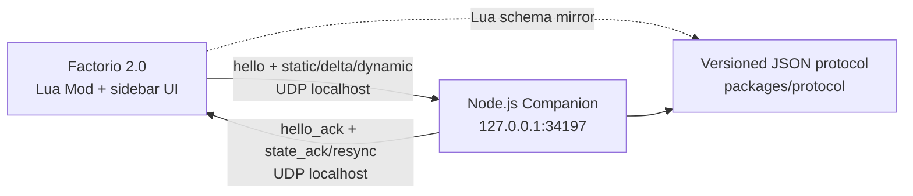

# Factorio AI Assistant

Factorio 2.0 原版的只读游戏内顾问。当前 M1 在 localhost UDP 桥接之上提供版本化
静态 / 动态状态摘要：配方与机器原型、force 科技、滚动产销、当前研究和电力聚合。
不接入模型、不发送地图或聊天，也不会修改工厂。

## 架构



浏览器可视化版本见 [`docs/architecture.html`](docs/architecture.html)。

## 仓库结构

| 路径 | 作用 |
| --- | --- |
| `factorio-mod/` | Factorio 2.0 Mod、事件缓存、状态采样和连接面板 |
| `companion/` | 只绑定 `127.0.0.1` 的 Node.js UDP Companion 与 revision 状态缓存 |
| `packages/protocol/` | 严格的版本化消息编解码与校验 |
| `docs/` | Windows 安装、协议、排错和实机验证清单 |

## 本地验证

需要 Node.js 22 或更高版本。

```bash
npm install
npm run build
npm test
npm run lint
```

启动 Companion：

```bash
npm start
```

完整的 Mod 安装、Steam 启动参数和 UI 预期见
[`docs/setup-windows.md`](docs/setup-windows.md)。线协议见
[`docs/protocol.md`](docs/protocol.md)。

## 安全边界

- Companion 固定绑定 IPv4 loopback `127.0.0.1`，没有公网监听配置。
- Factorio UDP 必须通过显式启动参数开启。
- 状态只含游戏 / Mod / force / prototype ID 和聚合数值；无坐标、地图、聊天或存档。
- 动态采样每 5 秒读取游戏统计和事件维护的 pole 缓存；没有 `on_tick` 全实体遍历。
- 无 RCON、远程遥测、AI 或自动操作。
- 仓库不读取或存储 API key、令牌等密钥。
