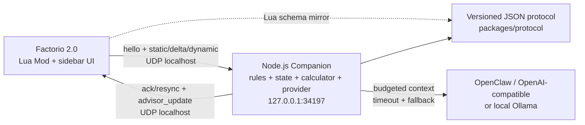
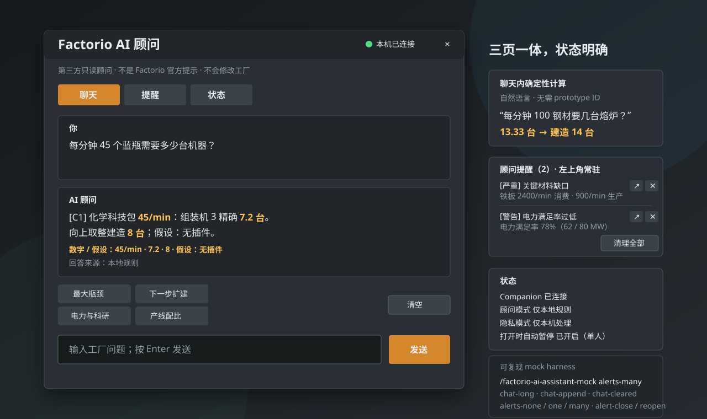

# Factorio AI Assistant

Factorio 2.0 原版的只读游戏内顾问。v0.1.0-rc.3 把聊天、确定性生产比例、内置原版流程指南、
实时提醒和连接状态整合进可移动的游戏内面板：玩家只用自然语言提问，数字与证据全部由受限的只读
计算 / 顾问工具产生；Companion 支持 OpenClaw / OpenAI-compatible 与 Ollama，无 Key、模型
离线、限流、超时或与工具冲突时自动保留本地计算与规则答案。系统不发送地图，也不会
修改工厂。

> **Steam 成就警告：** Factorio 启用任何 Mod 后，该存档都不能获得 Steam 成就。
> 安装前备份存档，并优先使用专门的测试副本。

## v0.1.0-rc.3 私有候选

CI 生成可重复验证的 Mod ZIP、Windows Companion ZIP、示例配置、性能报告、
`SHA256SUMS` 和总 bundle。Mod ZIP 与 Companion ZIP 使用确定性打包，同一提交重复构建
SHA-256 不变；`performance-baseline.json` 是每次构建的实测数据，因此它和总 bundle 的
SHA-256 每次构建各不相同，以 Release 内的 `SHA256SUMS` 为准。推荐流程：

1. 从私有 GitHub Release 下载同一个 `v0.1.0-rc.3` 的全部资产并核对 SHA-256。
2. 按 [`docs/setup-windows.md`](docs/setup-windows.md) 安装 Mod、配置 Steam UDP 参数并
   运行 `start-companion.cmd`。
3. 按 [`docs/windows-smoke-test.md`](docs/windows-smoke-test.md) 做 25–40 分钟实机冒烟；
   再按 [`docs/performance.md`](docs/performance.md) 完成三场景、30 分钟稳定性/UPS 验证。

本轮变更、已知限制和实机验收清单见
[`docs/releases/v0.1.0-rc.3.md`](docs/releases/v0.1.0-rc.3.md)。

Mod 和 Companion 必须来自同一 bundle；混用版本时 UI 会显示双方版本并要求成对升级
或降级。此候选不会自动发布到 Factorio Mod Portal。

## 架构



浏览器可视化版本见 [`docs/architecture.html`](docs/architecture.html)。

## 仓库结构

| 路径 | 作用 |
| --- | --- |
| `factorio-mod/` | Factorio 2.0 Mod、事件缓存、状态采样、三页顾问 UI、单人自动暂停与 mock harness |
| `companion/` | 只绑定 `127.0.0.1` 的 Node.js UDP Companion、状态缓存、本地规则顾问、上下文压缩和 provider 层 |
| `packages/protocol/` | 严格的版本化消息编解码与校验 |
| `packages/calculator/` | 精确有理数生产流求解器、Factorio 2.0 fixture 与 JSON CLI |
| `packages/guide/` | 版本化的 Factorio 2.0 原版流程指南数据与确定性阶段判定引擎 |
| `docs/` | Windows 安装、协议、规则阈值、流程指南、排错和实机验证清单 |
| `scripts/lua/` | Mod 的 Lua 规格测试与最小 Factorio 运行时替身（由 `npm test` 驱动） |

## 游戏内面板



预览使用内置 mock harness 的确定性数据绘制，对应实机布局和文案；自动化环境没有
Factorio 图形客户端，Windows 实机截图仍列在验证清单中。

- **Chat**：消息历史、快捷问题（含“产线配比”示例）、Enter 发送、取消请求、一键清空；回答区分事实、确定性
  计算、流程指南、推断、缺失数据与假设，行动项最多 3 个并引用规则 / 计算 / 指南证据。
  新消息、发送、完成和超时后自动贴回底部；向上翻看历史时，其它刷新（例如新告警到达）
  不会把视图抢回底部。问“下一步做什么 / 该扩建什么 / 该研究什么”时会调用内置的
  Factorio 2.0 原版流程指南，按当前已研究科技判定阶段并给出有顺序的步骤；有活动告警时
  先修当前瓶颈。
- **聊天内确定性计算**：不再有需要手填 prototype ID 的计算器页。直接问“每分钟 45 个
  蓝瓶需要多少台机器”“一分钟 120 绿板怎么配”，Companion 会用同步到的 catalog、游戏
  语言名称和常见中文别名解析出稳定 ID 与速率，再调用确定性求解器返回配方、精确台数
  与向上取整台数。目标、速率或替代配方不明确时，回答是一句简短澄清（例如“「电路」
  可能指绿电路 / 红电路 / 蓝电路”），而不是要求玩家输入内部 ID。
- **Alerts**：按严重度显示证据和建议，可静音 / 恢复规则，也可逐条忽略 / 恢复；主动
  提醒使用 8 秒第三方 toast，不写入聊天区连续刷屏。页面右上角的**清理全部**一次忽略
  本势力当前的全部活动提醒，没有可忽略的提醒时按钮为灰色。
- **常驻提醒卡片**：左上角待办式列表，只在有活动告警时出现，显示严重度、规则标题和
  证据摘要，并提供“打开顾问”、逐条忽略和“清理全部”。忽略只影响当前告警生命周期，
  告警关闭后再次触发会重新出现；规则静音仍是独立开关。清理全部只写当前玩家的忽略
  记录，不删除告警本身，也不改变安静模式或规则静音。
- **打开时自动暂停**：单人游戏中打开顾问会自动暂停游戏，关闭时恢复。该行为是每玩家
  设置（`打开 AI 顾问时自动暂停`，默认开启），顶部按钮、`Ctrl+Shift+A`、`Ctrl+Shift+1..3`
  和提醒卡片跳转走同一条开关逻辑。本 Mod 只恢复自己触发的那次暂停：打开前就已暂停、
  或中途被玩家手动恢复的情况都不会被覆盖，多人游戏则完全不改全局暂停状态。
- **Status**：Companion、模型模式、协议 / 状态架构、最近同步、显示名称语言与已同步
  名称数量，以及隐私模式。

面板和回答按当前游戏语言称呼产品、流体、科技、配方和机器（例如 `铁板` 而不是
`iron-plate`）。名称来自 Factorio 官方翻译机制，prototype ID 仍是协议主键，保留在
tooltip 与结构化输出中；尚未翻译或未知的 ID 安全回退为 ID 本身。

`Ctrl+Shift+A` 打开面板，`Ctrl+Shift+1..3` 依次切到 Chat / Alerts / Status，输入框按
Enter 提交，Esc 关闭（面板注册为当前打开的 GUI，所以 Esc 与关闭按钮走同一条清理路径）。窗口有三档尺寸，位置和尺寸按玩家写入存档。Companion 离线时
所有页面仍可进入，Alerts 显示带“可能过期”提示的缓存内容。

可在游戏控制台复现全部关键状态（建议停止 Companion，避免心跳覆盖 mock）：

```text
/factorio-ai-assistant-mock ready
/factorio-ai-assistant-mock offline
/factorio-ai-assistant-mock loading
/factorio-ai-assistant-mock timeout
/factorio-ai-assistant-mock incompatible
/factorio-ai-assistant-mock chat-long
/factorio-ai-assistant-mock chat-append
/factorio-ai-assistant-mock chat-cleared
/factorio-ai-assistant-mock alerts-none
/factorio-ai-assistant-mock alerts-one
/factorio-ai-assistant-mock alerts-many
/factorio-ai-assistant-mock alert-close
/factorio-ai-assistant-mock alert-reopen
/factorio-ai-assistant-mock clear
```

`chat-long` 铺满滚动区以便手动上翻，`chat-append` 在不重置历史的前提下追加一条新
消息（用于验证“上翻后仍会因新消息回到底部”），`chat-cleared` 复现清空后的空状态；
`alerts-none / alerts-one / alerts-many` 覆盖常驻卡片的 0 / 1 / 多告警布局，
`alert-close` 关闭当前告警，`alert-reopen` 以新的生命周期重新触发，用于验证被忽略
的提醒会重新出现。

## 本地验证

需要 Node.js 22 或更高版本。`npm test` 除 TypeScript 包外，还会在一个最小的
Factorio 运行时替身上加载 `factorio-mod/` 的 Lua 模块，覆盖自动暂停与批量清理提醒的
开关路径。

```bash
npm install
npm run build
npm test
npm run lint
npm run check:release
npm run check:security
npm run benchmark
npm run package
npm run package:verify
```

启动 Companion：

```bash
npm start
```

默认输出 `assistant_mode: local`，不需要 API Key。完整的本机 JSON / 环境变量配置、
OpenClaw/OpenAI-compatible、Ollama、上下文边界、脱敏日志和模型故障排查见
[`docs/companion.md`](docs/companion.md)。

独立运行比例计算器 CLI（不需要游戏或 AI Key；游戏内已由聊天自动调用同一个引擎）：

```bash
npm run calculate -- \
  --catalog packages/calculator/fixtures/vanilla-2.0.72-base.json \
  --request packages/calculator/fixtures/chemical-science-120-per-minute.json \
  --pretty
```

catalog 使用状态协议中的 `recipes`、`machines`、`modules` 和当前 force 的
`recipe_productivity_bonuses`。request 的核心字段如下：

| 字段 | 说明 |
| --- | --- |
| `targets[]` | `kind`、`id`、`rate` 和可选 `unit`（`second` / `minute`） |
| `available_recipe_ids` / `recipe_choices` | 当前可用配方与替代配方显式选择；选择键为 `item:<id>` / `fluid:<id>` |
| `allowed_machine_ids` / `machine_choices` | 允许机器集合与按 recipe ID 的显式机器选择 |
| `module_loadouts` | 按 recipe ID 指定插件 ID 数组；校验槽位、类别和效果限制 |
| `technology_productivity_bonuses` | 按 recipe ID 覆盖当前科技产能加成 |
| `source_resources` | 视为外部供给、不继续展开的原料键 |
| `byproduct_handlers` / `byproduct_policy` | 指定副产物消费配方；`balanced` 要求无剩余，`surplus` 显示剩余 |
| `belt_speeds` | 可选物品带宽档位；默认原版黄 / 红 / 蓝带 `15 / 30 / 45 item/s` |

输出包含每条配方的 craft 速率、精确与向上取整机器数、机器 / 插件 / 科技假设、各层
物品和流体速率、外部原料、副产物及各级传送带需求。循环、不可达目标、替代配方歧义、
不兼容机器 / 插件和无法平衡的多产物流都会返回结构化错误，不会递归死循环。

完整的 Mod 安装、升级/降级、卸载、Steam 启动参数和 UI 预期见
[`docs/setup-windows.md`](docs/setup-windows.md)。线协议见
[`docs/protocol.md`](docs/protocol.md)。规则证据、默认阈值、静音和全部玩家可配置项见
[`docs/advisor.md`](docs/advisor.md)。内置原版流程指南的资料来源、阶段划分、规则结构和
更新流程见 [`docs/guide.md`](docs/guide.md)。

### 当前限制

- 聊天计算自动选择上游配方与机器；遇到同一资源的多配方歧义会给出澄清而不是猜测，
  显式指定机器 / 插件 / 替代配方仍使用仓库内的 JSON CLI。
- 模型调用只能取消仍在进行的请求；已经完成并进入 UDP 的响应可能先于取消到达。
- 自动化测试覆盖协议、Companion、计算服务、Lua 语法、UI 状态契约和中英文 key
  对齐；像素布局、键盘焦点和不同 DPI 仍需 Windows Factorio 实机确认。
- 自动性能报告覆盖 Node 状态处理和 30 分钟提醒模拟；真实 Lua/UI UPS 与连续运行仍需
  Windows 实机验收。

## 安全边界

- Companion 固定绑定 IPv4 loopback `127.0.0.1`，没有公网监听配置。
- 配置远程 bind 地址会拒绝启动；相同 UDP 请求幂等重放 ack，同 ID 冲突包拒绝。
- Factorio UDP 必须通过显式启动参数开启。
- 状态只含游戏 / Mod / force / prototype ID 和聚合数值；无坐标、地图、聊天或存档。
- 动态采样每 5 秒读取游戏统计和事件维护的 pole 缓存；没有 `on_tick` 全实体遍历。
- 实时规则顾问和确定性计算不调用模型；AI provider 只接收按问题压缩且有 byte budget 的
  聚合上下文，无 RCON、远程遥测或自动操作。
- 内置流程指南是仓库内的静态数据，运行时不联网、不抓攻略，也不会把网页内容交给模型。
- API Key 只从 Companion 进程环境或显式本机配置读取，不进入 Mod、存档、UDP 或日志。
- 模型调用有取消、每次超时和最多一次有限重试；失败后返回本地结果。
- 模型只能解释已经执行的只读工具结果；数字冲突、无证据引用、额外行动列表或可执行
  Lua/RCON 输出会被丢弃并记录，最终以工具结果为准。
